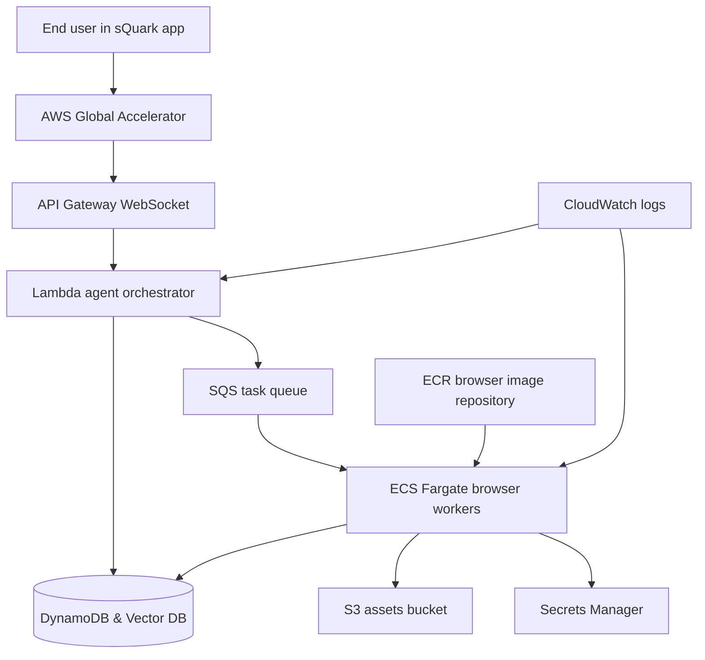
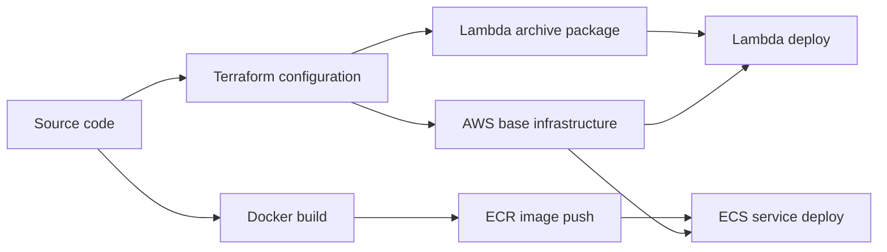

# sQuark AI Browser AWS Architecture White Paper

## Executive Summary

sQuark AI browser uses AWS infrastructure to support real-time orchestration, browser task execution, session tracking, secure secret handling, and durable asset storage. The architecture is intentionally split into small, well-defined cloud services so that each part of the system has a single clear responsibility.

This design improves three things at the same time:

- user responsiveness
- operational resilience
- deployment clarity

At a high level, API Gateway receives live client traffic, Lambda coordinates incoming events, SQS buffers work, ECS Fargate runs the browser workers, DynamoDB stores session state, S3 stores generated assets, Secrets Manager protects credentials, and ECR manages deployable container images.

## Why This Architecture Exists

The sQuark AI browser is not a static website and not a simple REST API. It needs an infrastructure model that can support:

- live user sessions
- asynchronous browser tasks
- heavy compute for browser automation
- secure access to third-party credentials
- reliable storage for state and output files

A single server could perform some of these jobs, but it would create avoidable bottlenecks and failure modes. The AWS design used here separates coordination, queuing, execution, and storage so that each layer can scale and fail more gracefully.

## Architectural Principles

### 1. Fast front, heavy back

The front of the system should answer quickly via Edge-optimized endpoints. Long-running work is decoupled via asynchronous event streams.

### 2. Small components with clear jobs

Each AWS service handles one main concern. This makes the system easier to reason about, test, secure, and replace.

### 3. Semantic Memory & Durable State

Stateless compute layers utilize a dual-storage strategy: DynamoDB for session state and Vector Databases for semantic context and RAG.

### 4. Security by default

Secrets live in Secrets Manager, public access is blocked on S3, and IAM roles are separated by workload.

### 5. Repeatable infrastructure

Terraform defines the environment so the same architecture can be recreated consistently across deployments.

## Logical Architecture

## Component Responsibilities

### API Gateway

API Gateway serves as the public connection surface for real-time traffic. It keeps the client-facing edge simple and forwards WebSocket events to Lambda.

### Lambda Agent Orchestrator

Lambda handles lightweight coordination. It responds to connection lifecycle events, records session state, and places heavy work into the queue rather than executing that work inline.

### SQS

SQS provides controlled decoupling between ingestion and execution. It smooths burst traffic, supports retries, and reduces the risk that temporary worker pressure will break the front-end experience.

### ECS Fargate

Fargate runs the browser worker containers. This is the correct layer for heavy automation because browser workloads often require more memory, longer execution windows, and stronger isolation than Lambda is designed for.

### DynamoDB & Vector Memory

DynamoDB handles real-time session state, while a Vector Store (e.g., OpenSearch Serverless) enables semantic retrieval of user browsing history and agentic context.

### S3

S3 stores generated artifacts such as screenshots and exported browser results. This prevents transient compute nodes from becoming stateful file stores.

### Secrets Manager

Secrets Manager protects API keys and integration credentials. This reduces operational risk by removing secrets from source control, image layers, and plain-text configuration.

### ECR

ECR provides versioned storage for browser worker images. It supports cleaner deployments and makes ECS updates repeatable.

## Deployment Architecture

## Operational Advantages

### Ultra-Low Latency

By utilizing Global Accelerator and Edge-side orchestration, the "Time to First Interaction" is minimized, rivaling the performance of top-tier AI labs.

### Intelligent Scaling

The system utilizes predictive scaling for ECS workers based on both SQS depth and historical usage patterns, ensuring capacity is available before the user requests it.

### Safer failure handling

If a worker fails, the queue and orchestration layers still exist. If traffic spikes, work can wait in SQS rather than being dropped immediately.

### Easier observability

CloudWatch logs for Lambda and ECS create a direct operational trail for debugging and incident response.

## Cost Awareness

This architecture is designed to be practical, but it is still important to understand where cost comes from.

The biggest cost drivers are usually:

- ECS Fargate compute for browser workers
- data transfer and runtime usage through API Gateway WebSocket connections
- S3 storage for generated assets
- CloudWatch log volume
- DynamoDB usage at higher session or event volumes

### Why the design can still be cost-efficient

Several choices in this stack help control waste:

- Lambda is used for short orchestration work instead of long-running coordination servers.
- SQS absorbs bursts so the system does not need to overprovision compute all the time.
- Fargate keeps the operations model simple and avoids managing EC2 fleets.
- S3 stores artifacts cheaply compared with keeping them inside running compute.

### Where teams should watch spending first

If cost becomes a concern, inspect these areas in order:

1. ECS task size and desired count.
2. Queue depth patterns that suggest over- or under-scaling.
3. CloudWatch log retention and log volume.
4. S3 object growth from screenshots and generated assets.
5. API Gateway connection duration and message volume.

### Practical optimization levers

The clearest future cost controls are:

- scale ECS workers based on queue depth instead of fixed count
- right-size CPU and memory for browser workers
- reduce unnecessary artifact retention in S3
- shorten CloudWatch retention where appropriate
- separate high-value browser jobs from low-priority background work

The right optimization strategy depends on product usage. Early on, clarity and reliability are often worth more than chasing the absolute lowest cloud bill.

## Security Posture

The current infrastructure includes several good defaults:

- server-side encryption for S3
- public access blocks on S3 buckets
- IAM role separation between Lambda and ECS
- secret retrieval through Secrets Manager
- image scanning on push in ECR

This is a strong starting point, though production maturity can still be improved with alarms, tighter IAM scopes, WebSocket authorization policies, and autoscaling rules.

## Current Limitations and Future Maturity Path

The present stack is a strong foundation, but it is still a foundation. A fuller production posture would likely add:

- ECS autoscaling based on SQS depth
- CloudWatch alarms and dashboards
- structured application metrics
- stronger user identity and authorization controls
- explicit disaster recovery procedures
- workload-specific security boundaries

## Appendix A: Security Review Checklist

This appendix is meant for enterprise buyers, security reviewers, and internal auditors who want a quick structured review of the current stack.

### Identity and access

- Are Lambda and ECS using separate IAM roles?
- Are permissions scoped to the resources each workload actually needs?
- Are there any wildcard permissions that should be tightened later?
- Are human deployment credentials separated from runtime credentials?

### Secret handling

- Are API keys stored in Secrets Manager rather than source code?
- Are secrets injected at runtime instead of baked into images?
- Is there a documented process for secret rotation?

### Storage controls

- Are S3 buckets encrypted?
- Is public access blocked on all buckets?
- Are asset retention and deletion expectations defined?
- Is DynamoDB storing only the session data that is actually needed?

### Network and exposure

- Is the WebSocket entry point the only intended public interface?
- Are ECS services exposed only as much as needed for their operating model?
- Are future private networking improvements identified if the workload grows?

### Logging and monitoring

- Do Lambda and ECS both write logs to CloudWatch?
- Are log retention settings reviewed periodically?
- Are alarms and dashboards planned for production maturity?

### Software supply chain

- Are container images stored in ECR?
- Is image scanning enabled on push?
- Is there a repeatable deployment path through Terraform and the deploy script?

### Operational resilience

- Is work buffered through SQS?
- Is there a dead-letter queue for failed message handling?
- Can the stack be recreated from source-controlled infrastructure code?

### Review outcome guidance

If most answers above are yes, the stack has a credible baseline security posture for an early controlled deployment. If several answers are no, the next investment should focus on IAM tightening, runtime monitoring, and explicit operational controls before broader rollout.

## Conclusion

The sQuark AWS architecture is intentionally practical. It uses managed AWS services to separate connection handling, orchestration, buffering, execution, state, storage, and secrets into distinct layers. That makes the platform easier to understand, easier to operate, and easier to evolve as the AI browser grows.