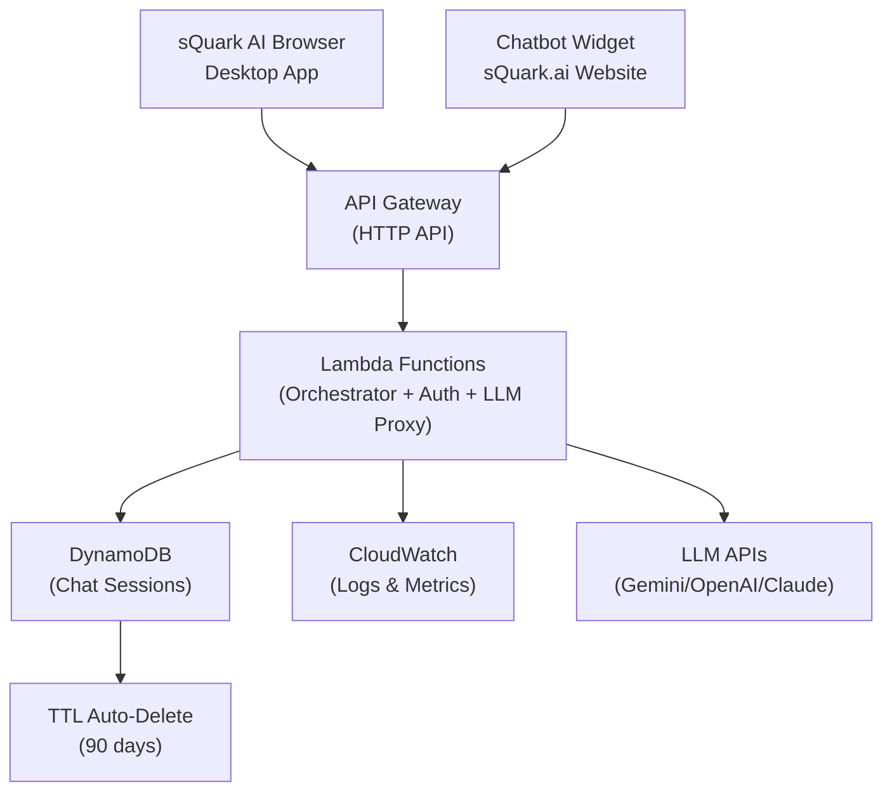
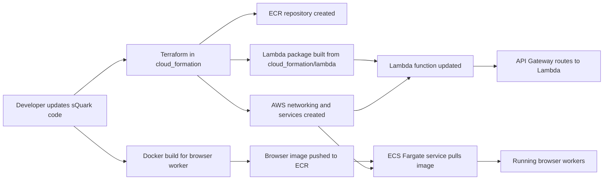

# sQuark Bot Backend - Dual-Purpose Chatbot API

Backend infrastructure for:
- **sQuark AI Browser** (Desktop application)
- **Chatbot in sQuark.ai Website** (Web widget)

This folder contains the AWS infrastructure for the unified sQuark Bot Backend.

The goal of this guide is simple: explain what each cloud piece does, how they work together, and why the system is built this way.

If you are new to AWS, think of this setup like a team of helpers:

- `API Gateway` is the front door.
- `Lambda` is the traffic manager (chatbot orchestrator).
- `DynamoDB` is the memory notebook (chat sessions).
- `CloudWatch` is the log keeper (monitoring).
- `S3` is the storage closet (optional assets).
- `ECR` is the container image warehouse (optional).

## What Problem This Architecture Solves

Both the sQuark AI Browser and the sQuark.ai website chatbot need a shared cloud backend for:

- Unified chatbot API endpoint
- Real-time message processing
- Session state management
- LLM integration (Gemini, OpenAI, Claude)
- User conversation history
- Scalable request handling

This infrastructure lets both applications share resources efficiently while maintaining separate session spaces.

## The Big Picture



## How Deployment Works

This second view shows how the infrastructure gets built and how code reaches AWS.



### Deployment Story in One Sentence

Terraform builds the AWS foundation, packages the Lambda, creates the ECR repository, and then ECS runs the browser worker image that was pushed into that repository.

## Architecture in Plain English

### 1. API Gateway WebSocket

This is the live connection between the user's browser app and AWS.

Why it exists:

- It gives the app a single cloud endpoint to connect to.
- It supports two-way communication.
- It is a good fit for real-time AI or browser-control events.

What it does:

- accepts incoming WebSocket connections
- forwards messages to the Lambda orchestrator
- keeps the public entry point simple

### 2. Lambda Agent Orchestrator

This is the brain at the front of the system.

Why it exists:

- It reacts quickly when a connection starts, ends, or sends a message.
- It is cheap because it runs only when needed.
- It does not keep a server running all the time.

What it does:

- records new sessions in DynamoDB when a client connects
- removes sessions when a client disconnects
- sends normal work into SQS for background processing
- returns a quick response so the user is not kept waiting

In this project, the Lambda code lives in `cloud_formation/lambda/index.py` and is packaged automatically by Terraform.

### 3. SQS Task Queue

This is the waiting line.

Why it exists:

- It prevents sudden traffic spikes from overwhelming browser workers.
- It lets work be processed in order.
- It makes the system more reliable because messages can be retried.

What it does:

- holds incoming browser jobs
- keeps failed jobs from disappearing immediately
- sends hard failures to a dead-letter queue for investigation

### 4. ECS Fargate Browser Workers

These are the workers that do the heavy lifting.

Why they exist:

- Browser automation is heavier than a small Lambda function.
- Headless browser tasks need more memory and CPU.
- Containers are a clean way to isolate and scale browser jobs.

What they do:

- read tasks from SQS
- run browser automation or AI browser work
- save state updates to DynamoDB
- save artifacts like screenshots to S3
- use secrets safely from Secrets Manager

Fargate means AWS runs the servers for you. You manage the container, not the machine.

### 5. DynamoDB Session State Table

This is the memory notebook.

Why it exists:

- WebSocket connections need lightweight session tracking.
- Workers may need to know what session they are serving.
- Fast read and write access is important.

What it stores:

- session IDs
- connection state
- timing information
- metadata about the active connection

### 6. S3 Assets Bucket

This is the storage closet.

Why it exists:

- Generated files should not be stored inside containers.
- Containers can stop and restart, but files in S3 stay safe.
- S3 is a good place for screenshots, exports, and browser-generated assets.

What it stores:

- screenshots
- generated assets
- downloadable files created by browser workers

### 7. Secrets Manager

This is the lockbox.

Why it exists:

- API keys should not be hardcoded in code or Terraform variables.
- Workers and Lambda can fetch secrets at runtime.
- It is safer than storing secrets in plain text.

What it stores:

- API keys
- tokens
- future integration secrets for models or third-party services

### 8. ECR Repository

This is the warehouse for container images.

Why it exists:

- ECS needs a container image to run.
- Versioned images make deployments more repeatable.
- You can push a new browser worker image and redeploy cleanly.

What it stores:

- the AI browser worker container image
- tagged versions of the worker image

### 9. CloudWatch Logs

This is the system journal.

Why it exists:

- You need logs when debugging failures.
- Lambda and ECS both write runtime information here.
- It is the first place to check when something breaks.

What it stores:

- Lambda execution logs
- ECS container logs
- error messages and startup details

## How a Request Moves Through the System

Here is the normal path for one user action.

1. The user opens sQuark and connects to the AWS WebSocket endpoint.
2. API Gateway receives the connection event.
3. Lambda records the session in DynamoDB.
4. When the user sends a job, API Gateway passes it to Lambda.
5. Lambda places the job into SQS.
6. An ECS Fargate browser worker reads the job from SQS.
7. The worker performs the browser task.
8. The worker stores state in DynamoDB and files in S3.
9. Logs from Lambda and ECS go to CloudWatch.

This design keeps the front of the system fast and the heavy work in the worker layer.

## Why the Architecture Is Split This Way

This is not one big server because one big server becomes harder to scale and easier to break.

Instead, each AWS service has one main job:

- `API Gateway` handles connections.
- `Lambda` handles quick coordination.
- `SQS` handles buffering.
- `ECS` handles heavy work.
- `DynamoDB` handles session memory.
- `S3` handles file storage.
- `Secrets Manager` handles secrets.

That separation gives three big benefits:

### Faster response times

The system does not make the user wait for heavy work to finish before responding.

### Better scaling

If many tasks arrive at once, SQS can hold them while ECS workers catch up.

### Safer operations

If one worker fails, the whole system does not fail with it.

## Files in This Folder

### `sQuark.tf`

The main Terraform file that defines the AWS infrastructure.

### `lambda/index.py`

The Python Lambda handler used by the WebSocket orchestrator.

### `terraform.tfvars.example`

An example variables file you can copy into a real `terraform.tfvars` file.

### `deploy_browser_stack.sh`

A helper script that:

- initializes Terraform
- bootstraps the ECR repository
- builds the browser image
- pushes the image to ECR
- applies the full stack

### `ARCHITECTURE_WHITEPAPER.md`

An enterprise-style explanation of why the AWS architecture exists, what business and technical goals it supports, and how the major components fit together.

### `OPERATOR_RUNBOOK.md`

A practical troubleshooting guide for engineers who need to deploy, inspect, and recover the AWS stack during development or operations.

## Security Choices in This Stack

The infrastructure already includes a few important guardrails:

- S3 buckets have public access blocked.
- S3 buckets use server-side encryption.
- ECR image scanning is enabled on push.
- Secrets are stored in Secrets Manager instead of plain text.
- IAM roles are separated for Lambda and ECS tasks.
- CloudWatch keeps logs for both Lambda and ECS.

## What This Stack Does Not Do Yet

This stack creates the infrastructure foundation, but it does not automatically solve every application concern.

Examples of work still owned by app code:

- deciding which browser task to run
- sending messages back to connected WebSocket clients
- scaling ECS workers based on queue depth
- more detailed auth rules for different user types
- deep monitoring dashboards and alarms

That is normal. Terraform creates the building. The application still decides what happens inside the rooms.

## Simple Mental Model

If you remember only one thing, remember this:

> The AWS stack is a factory line.
>
> - The user sends a request in.
> - Lambda sorts the request.
> - SQS holds the request.
> - ECS workers do the hard work.
> - DynamoDB remembers the state.
> - S3 keeps the files.

That is the whole architecture in one picture.

## How to Deploy It

From this folder:

```bash
cp terraform.tfvars.example terraform.tfvars
./deploy_browser_stack.sh
```

If you want a different image tag:

```bash
./deploy_browser_stack.sh terraform.tfvars v1
```

## Good First Questions for New Team Members

If someone is learning this stack, these are the best first questions to ask:

- Where does the user first enter the system?
- Which service reacts immediately?
- Which service stores work for later?
- Which service does the heavy browser job?
- Where is session state saved?
- Where are generated files stored?
- Where do secrets live?

If they can answer those, they understand the architecture.

## Next Reading

- [EXECUTIVE_SUMMARY.md](EXECUTIVE_SUMMARY.md) for a one-page non-technical overview for leadership and stakeholders.
- [ARCHITECTURE_WHITEPAPER.md](ARCHITECTURE_WHITEPAPER.md) for an executive and enterprise-facing architecture narrative.
- [OPERATOR_RUNBOOK.md](OPERATOR_RUNBOOK.md) for deployment, troubleshooting, and day-2 operations.
- The runbook now includes AWS Console navigation notes, and the white paper includes cost awareness plus a security review appendix.